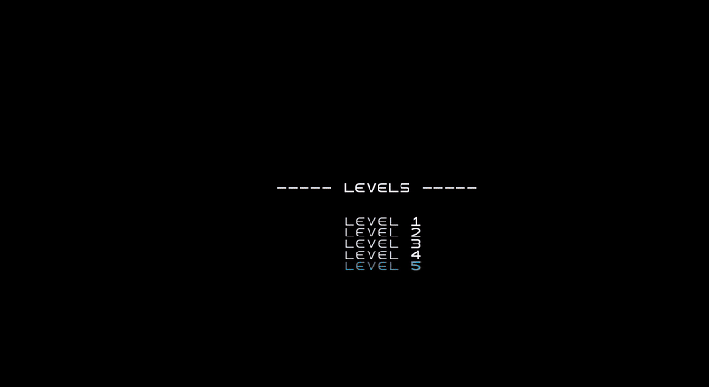
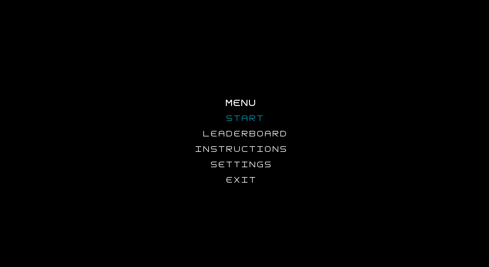
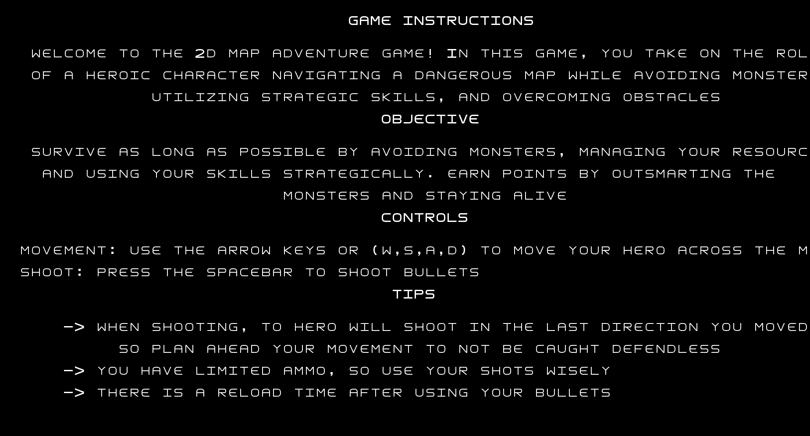
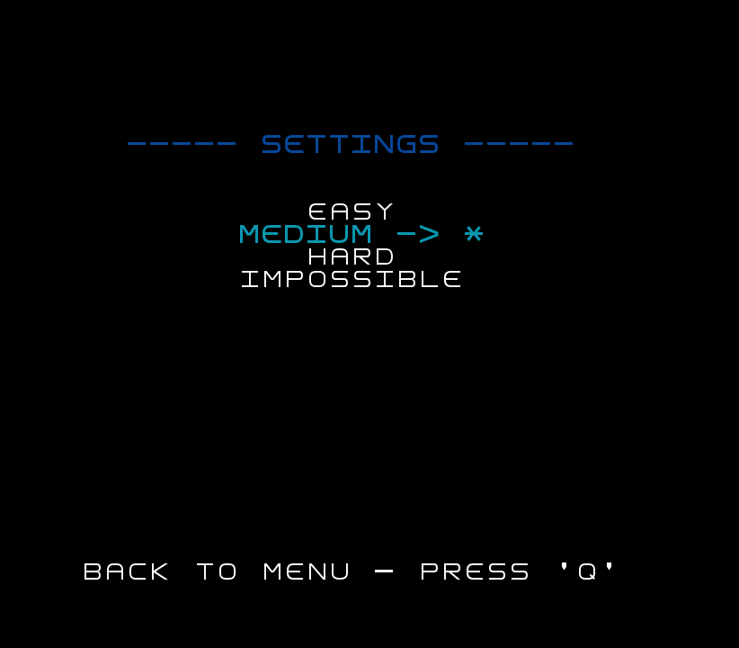
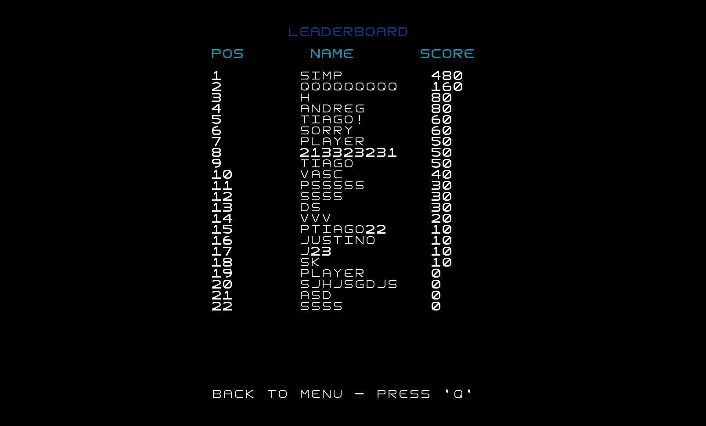

# LDTS_T09G06 Gauntlet

Welcome to our home made Gauntlet inspired game. Dive into relentless adventure where danger lurks around every corner, and only the most skilled players will survive.

What can you experience ? Take on the role of a brave hero as you face endless waves of foes, collect valuable loot and find doors to unlock new areas. As you progress things grow more difficult, and you, as the face of the good side, must have sharp reflexes and the best strategic thinking.

Project developed by André Gomes (up202304252@up.pt), Tiago Carvalho (up202103339@up.pt) and Vasco Alves (up202304912@up.pt) for **Software Design and Test Laboratory** subject of the second year of **Informatics and Computing Engineering Course**.

For a more detailed version of this description click [here](./docs/README.md).

## Screenshots

The following screenshots ilustrate the general look of our game, as well as the divergent functionalities:

### Game preview

  

  <b><i>Gif 1. Gameplay of Gauntlet</i></b>

 
 

### Menus

  

  <b><i>Fig 1. Main Menu </i></b>

  

 
 

  

  <b><i>Fig 2. Instructions Menu </i></b>  

  

 
 

  

  <b><i>Fig 2. Instructions Menu </i></b>  

  

 
 

  

  <b><i>Fig 4. Leaderboard Menu </i></b>

 
 

